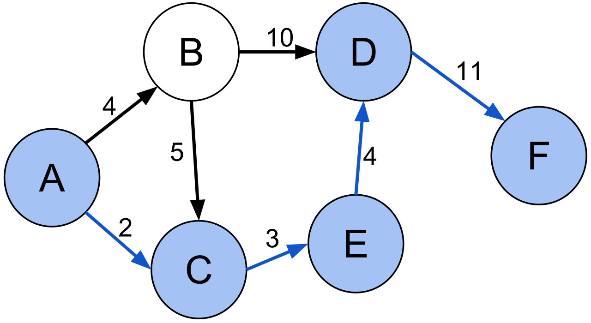

# Data Structure 2021 Midterm Project: Pagerank on Graph

## 프로젝트 소개
* 이번 프로젝트는 구글이 처음 세워졌을 때 어떤 식으로 중요한 웹사이트를 찾았는지 그 방법을 배워보는 프로젝트입니다.
  * Pagerank를 구현해 봅시다. 
  * 실제 데이터를 통해 PageRank가 가지는 의미에 대해 생각해 봅시다.

* 그래프(네트워크)상에서 중요한 노드(정점)를 구분하는 방법으로 Centrality Measure라는 것이 있습니다.
  * 쉽게 말해서 이 노드가 전체에서 얼마나 "중심"에 있는지를 보는 방법입니다.
  * 구하는 방법이 여러가지이고, 각각 다른 결과를 내 줍니다. 
    * 궁금하신 분들은: Betweennes centrality, Closeness centrality, Eigenvector centrality등을 찾아보세요.
  * 이번 프로젝트에서는 이 중 Google의 시작이라 할 수 있는 [Pagerank](http://ilpubs.stanford.edu:8090/422/) 에 대해서 다룹니다. 

* Pagerank의 아이디어는 매우 단순합니다.
  * 전제조건: 다른 많은 노드에서 하이퍼링크를 "받는" 노드가 중요한 노드일 것이다.
  * 전제조건2: 중요한 노드가 주는 하이퍼링크가 "더" 중요한 링크이다
  * 즉, 링크가 많이 "들어올" 수록 중요한 노드이고, 중요한 노드에서 링크를 많이 받을수록 중요한 노드라는 뜻입니다.
  * 아래의 그림을 참고해 봅시다.
    
 
    출처: 위키백과 

  * 점의 크기가 Pagerank 값이라고 생각해 봅시다.
  * B는 "받는" 하이퍼링크가 가장 많습니다. 그래서 가장 점수가 높습니다
  * 똑같이 한 개의 링크를 받고 있는 A와 C에 대해서 생각해 봅시다.
    * A는 "덜 중요한 노드 D"에게 링크를 받고있어서 점수가 낮습니다
    * C는 "더 중요한 노드 B"에게 링크를 받고있어서 점수가 높습니다.
  * 즉, 이런 식으로 점수를 메기면, 더 중요한 노드르 구분할 수 있다는 것입니다. 

* 이런 "하이퍼링크가 많은 노드"를 어떻게 찾아야 할까요? 이를 위해서 Random Walker라는 개념을 도입합니다
  * Random Walker는 매 시간 자기 이웃 중 하나를 "무작위로" 택해서 이동하는 Walker 입니다. 
    * Walker는 그래프 위를 돌아다니는 가상의 개체입니다. 

* 가중치가 없는 그래프의 각 노드에서 특정 이웃으로 이동할 확률은 아래와 같습니다.
  * 그래프에서 노드 I에 있는 Walker가 특정 이웃 노드 K로 이동할 확률은 1 / n (여기서 n은 이웃의 총 수)
  * 위의 그림 예를 한번 들어보죠. Random Walker가 E에서 시작한다고 생각해 봅시다.
  * E는 자신부터 다른 이웃으로 이어진 간선을 B, D, F 에게 향하고 있습니다. 
  * 전체 이웃이 3개이므로, 이웃한 각각의 간선으로 이동할 확률은 1/3 입니다. 
 
* 가중치가 있는 그래프의 경우는 가중치의 종류에 따라 다릅니다.
  * 강의시간에 설명드리겠지만 가중치는 두 가지 종류가 있습니다.
  * 클 수록 노드 사이의 관계가 더 "적어지는" 가중치: 거리 등.
  * 클 수록 노드 사이의 관계거 더 "커지는" 가중치: 둘 사이의 유사도, 공통된 친구의 수 등.
  * **이 프로젝트에서는 "클수록 관계가 더 적어지는 가중치"는 다루지 않습니다.** 
    * 이런 경우의 Random Walker의 이동 확률을 계산하는 문제는 아주 어려운 문제이기 때문입니다.
  
* 가중치가 있는 경우는 어떻게 생각하면 될까요?
  * 가중치에 비례하는 확률로 이동한다고 가정합니다.
  * 아래의 그래프 예를 들어봅시다.
  * A노드가 이동할 수 있는 이웃은 B와 C입니다.
    * 각각의 가중치는 A->B=4, A->C=2 입니다.
    * Random Walker가 A에 있을 때, B로 이동할 확률은 4/(4+2) = 4/6 입니다.
    * Random Walker가 A에 있을 떄, C로 이동할 확률은 2/(4+2) = 2/4 입니다.
    
 
    출처: 위키백과 

* 하지만 단순히 이렇게 주변 이웃으로만 이동하는 Random Walker만 사용하면 Walker는 처음 시작한 노드 주변에서 멀리 퍼져나가기 힘듭니다.
  * 그래서 Pagerank는 이웃 탐색을 멈추고 완전히 다른 곳으로 이동할 확률 q를 줍니다.
  * 그래서 사실 매 시간 Walker는 두가지 중의 하나의 일을 합니다.
    * (1-q)의 확률로 위의 규칙에 따라 이웃 노드를 탐색
    * q의 확률로 임의의 노드로 점프. 이 경우에는 이웃하지 않은 노드라도 무작위로 선택해서 이동합니다. 
      * 전체 노드의 수가 K개라면 균등한 확률인 1/k로 이동한다고 가정합시다.

* Random Walker 에 대해서는 [이 영상](https://www.youtube.com/watch?v=l__fEY1xanY)을 한 번 참조해주세요
  * 위는 2차원에서의 random walker이지만, 우리는 그래프 위에서의 random walker를 다룹니다.
  * 하지만 본질적인 차이는 없지요!

* 사실 실제로 PageRank를 이렇게 구현하지는 않습니다. 이 방법은 매우 느리고 비효율적이죠. 

## 해야 할 일들

* 프로젝트에서는 해야 할 일만 제시하고,  본인이 직접 함수 이름도 정하시고 하고싶은 실험도 직접 해 보시면 됩니다.
  * 실제 코드를 작성하시고, 분석하고 실험한 내용에 대한 보고서를 A4용지 3-4장 내외로 작성해주세요
  * 더 많이 작성하셔도 됩니다 (읽는 제가 좀 힘들겠지만...^^;)

* 그래프를 저장하는 방법은 어떤 것을 쓰셔도 됩니다.
  * 수업에 배운 방법 중 Adjacency list, Adjacency matrix, edgelist 등등 어떤 방법을 쓰셔도 됩니다.
  * 다만 선택하는 방법에 따라서 구현이 쉬워지거나 어려워질 수 있습니다.

### (10-11주차) 가중치 없는 그래프에서 PageRank

* Task1: 가중치가 없는 그래프에서 Random Walker를 만들어 주세요.
  * 임의의 입력받은 노드부터 시작해서 이동하는 Random Walker를 만들어 주세요
  * Walker는 매 시간 q의 확률로 모든 노드중 하나를 선택하여 점프합니다.
  * 입력 파라미터는 아래의 것을 기본으로 기능에 따라 추가하거나 빼시면 됩니다.
    * 시작하는 노드 i:
    * 전체 Walking length n: 충분히 크지 않으면 알고리즘이 제대로 작동하지 않습니다.
      * 점프/이동을 합쳐서 n번 하면 알고리즘이 멈춥니다.
      * 최소 어느정도 수치가 되어야 시작점에 따른 차이가 거의 없어질까요?
    * 임의의 노드로 점프할 확률 q

* Task2: 이를 통해서 PageRank를 구하는 함수를 만들어 주세요
  * 특정 노드 i의 PageRank는 walker가 이동한 전체 경로 중 i를 방문한 횟수를 가지고 구합니다.
  * 이 횟수를 n(i)라고 두면 총 이동한 경로의 길이는 위에 지정한 walking length 모든 노드들의 n(i)의 합이 됩니다.
  * 혹은 위에 지정한 전체 walking length n과 같아집니다.
  * 여기에서 노드 i의 pagerank는 n(i)/n 이 되고, 모든 노드의 pagerank를 합치면 1이 됩니다.

* Task3: 실제 그래프 데이터에 대해서 PageRank를 수행해보세요
  * dataset 폴더에 아래의 두 가지 데이터를 첨부해 두었습니다.
  * 두 개 모두 아래의 포맷을 따릅니다
    * SourceNode<TAB>TargetNode<Tab>Weight
  * 방향성이 없는 데이터: 스타워즈 네트워크
    * 출처: https://doi.org/10.5281/zenodo.1411479
    * 스타워즈에 나온 등장인물들이 서로 같은 장면에 나온 것을 모아둔 자료입니다.
    * 방향성이 없으므로 A->B의 간선이 있다면 B->A의 간선도 있다는 것을 유의해보세요.
    * PageRank 기준으로 스타워즈에 나온 중요한 등장인물들은 누구누구인가요??
    * SourceNode: 인물1, TargetNode: 인물2, Weight: 같이 등장한 장면 수
    * Files:
      * starwars-episode-*-interactions-allCharacters-nodes.tsv : starwars episode * 에 나온 인물들의 id와 이름
      * starwars-episode-*-interactions-allCharacters-nodes.tsv : starwars episode * 에 나온 인물들 사이의 공통 등장 빈도

  * 방향성이 있는 데이터: 따릉이 네트워크
    * 출처: http://data.seoul.go.kr/
    * 따릉이에서 자전거를 빌리고 다시 반납하는 station들의 이동 기록 데이터입니다.
    * 2021년 1월에 있었던 모든 따릉이 이동을 모은 데이터입니다.
    * SourceNode: 출발 station, TargetNode: 도착 station, Weight: station간 총 이동 횟수
    * Files:
      * station_names: station 번호와 그 이름  
      * bicycle_trips_all.tsv: 전체 이동 경로와 그 빈도
      * bicycle_trips_over*.tsv: *번 이상 이동한 경로

### (12주차) 가중치 있는 그래프에서
* Task4: 가중치가 있는 그래프에서 Random Walker를 만들어 주세요.
  * 자세한 것은 가중치 없는 그래프를 참조해주세요

* Task5: 이를 통해 가중치 있는 그래프에서 PageRank를 구하는 함수를 만들어 주세요
  * 자세한 것은 가중치 없는 그래프를 참조해주세요

* Task6: 실제 가중치가 있는 그래프 데이터에 대해서 PageRank를 수행해보세요
  * 자세한 것은 가중치 없는 그래프를 참조해주세요

* Task7: 가중치가 있는 경우와 없는 경우가 어떻게 달라지나요? 어떤 것이 더 잘 맞는 것 같나요?
  * 이외에 다양한 실험을 해 보시면 좋습니다. 
  
* 보고서는 따로 쓰시고, 실험은 따로 하시되 코드 짜고 이러는 것 같이 하셔도 됩니다. 
  * 어차피 코드 유사성 이런걸 떠나서, 제대로 이해하지 못하면 보고서에서 다 티가 납니다...

## 제출 방법

* Due Date: 추후에 정해질 기말고사 시험 직전까지. 
  * 미리 공지드립니다. 프로젝트는 **성적 입력 일정때문에 지연제출이 불가능합니다**.

* 스마트캠퍼스에 11주차 과제로 업로드되어 있습니다. 여기 업로드해주세요.
  * 보고서 PDF파일과 소스코드를 압축해서 한 파일로 만들어주세요
  * 파일은 DS2021_PR1_20212021_홍길동.zip 형태로 부탁드립니다
  * 제발 간절히 부탁합니다. egg 혹은 alz는 쓰지 말아주세요... (**감점할거에요**)

* 구현체는 제대로 작동을 하면 어떤 형태도 좋습니다.
  * 구현체는 구현 여부로 평가하겠습니다
  * 점수의 차이는 주로 해 보신 실험과 보고서에서 있을 것입니다. 재밌는 실험 많이 해보세요.
  * 굿럭!
